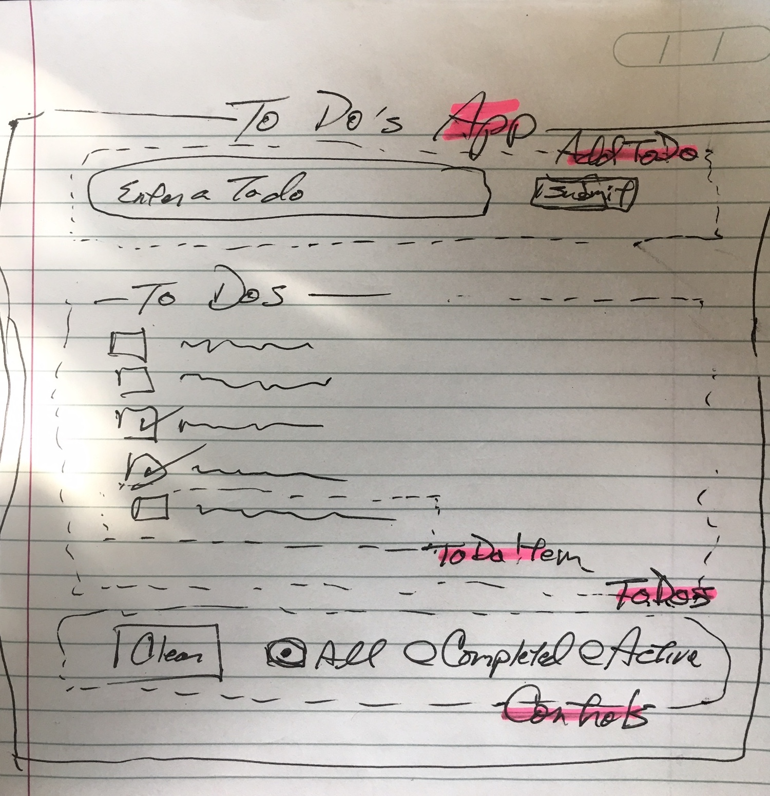

# Component Architecture with vanilla JS

## Concepts & Terms
* **Component** - piece of UI presentation & functionality to deliver content & respond to user interaction
* Components relate to each other in a **Node Tree** - a parent/child hierarchy: [https://en.wikipedia.org/wiki/Tree_(data_structure)](https://en.wikipedia.org/wiki/Tree_(data_structure))
* **Template** - piece of HTML that can be placed and presented by JS programming dynamically. 
* **Target** - an element in the DOM (being dynamically created) that a **Component** will append:   ```target.appendChild(component.render());```
* **Render** - a Component _will_ render some UI. That is, a Component will present to the User some portion of the web page.



## Components in To Do's App
* the _root_ is **App**
* **App** has 3 child nodes: AddToDo, ToDos, Controls
* **ToDos** has a child node, ToDoItem, that is used repeatedly


## Architecture
1. A root component prepares to mount itself into an empty body by substantiating its child nodes and mounting them to specific **target** locations (appendChild).
1. A Node (other than **root**) _will_ have One & Only One parent. A Node _may_ have One or More Child Nodes.
1. A Node _will_ **render** some UI that _may_ have some User Interactivity bound to it.
1. A Node will compose UI it presents by either:
	* generating DOM elements and mounting them to a _target_ 
	* AND/OR, substantiating child node(s) and mounting them to a _target_

```js
// ToDos.js

const listTemplate = document.getElementById('list-template'); // get this component's template

// ...

render() {
  // start this component's dynamic DOM with the contents of the template
  const dom = listTemplate.content.cloneNode(true); 
  
  // attach to a location in the template that will be the target of the li created on next lines
  const targetElement = dom.getElementById('list-target'); 
    
  for(var i = 0; i <= this.items.length; i++) {
    const li = document.createElement('li');  // create element
    li.innerText = this.items[i].description;  // decorate element w/ content & styling
    targetElement.appendChild(li);  // append element to target
  }
  
  return dom;      // return dynamically generated dom to parent element
}
```

**AND/OR** 

```js
// ToDos.js

const listTemplate = document.getElementById('list-template'); // get this component's template

// ...

render() {
  // start this component's dynamic DOM with the contents of the template
  const dom = listTemplate.content.cloneNode(true); 
  
  // attach to a location in the template that will be the target for the child rendered on next lines for each item
  const targetElement = dom.getElementById('list-target');  
    
  for(var i = 0; i <= this.items.length; i++) {
    const listItemComponent = new ListItem(this.item[i], onClick);  // substantiate child component
    targetElement.appendChild(listItemComponent.render());  // append child's dom to target
  }
  
  return dom;    // return dynamically generated dom to parent element
}
```


## Managing State
State is the variable space used to store: "those things that change" in the App.  In this architecture, the keyword **this** is used to store State.

```js
class App {
   constructor() {
      this.products = productData;
      this.totalVotes = 0;
   }
}
```

In the above example, the **this** properties:

* **products** is set to the variable ```productData```, which was set to a JSON Object Literal (mock data) in another file & _exported_.
* **totalVotes** is initialized to zero when App is substantiated.

Use the following guidelines when managing _state_:

* Store _state_ (**this**) properties in the **Component** that MOST CLOSELY CONTAINS all _childNodes_ that need this particular _state_.
* _State_ properties move in ONE direction flow - from _Parent_ to _Child_ component. Never from _Child_ to _Parent_.
* Pass _state_ properties from _parentNode_ to _childNode_ as Arguments of the Class when substantiating.
* _State_ properties CANNOT be passed from _Grandparent_ to _Grandchild_. A _Grandparent_ Node MUST pass _state_ properties to the _Parent_ node who then MUST pass them to the _Grandchild_ (its _child_) node for data to pass from _Grandparent_ to _Grandchild_ node.

For Example, let's look at a large Insurance Company App:


When we analyze the properties of each major node: Customers, Policies, Billing & Claims; we find the following:

* **Customer** properties are needed in all Nodes, and therefore will be held in _InsuranceApp_ (root)
* **Policies** properties are needed for _Policies_, _Billing_ & _Claims_; and therefore will be held in _InsuranceApp_ (root)
* **Billing** properties are needed just for _Billing_, and therefore will be held in _Billing_
* **Claims** properties are needed just for _Claims_, and therefore will be held in _Claims_.

```js
// InsuranceApp.js
class InsuranceApp {
   constructor() {
     this.customer = customerData;   // set InsuranceApp state to /*global*/ customerData 
     this.policy = policyData;       // set InsuranceApp state to /*global*/ policyData 
   }
}

// Customer.js
class Customer {
   constructor(customer) {       // receive customer from InsuranceApp (parent)
      this.customer = customer;  // set Customer state to customer received from parent
   }
}

// Policy.js
class Policy {
   constructor(customer, policy) {   // receive customer & policy from InsuranceApp (parent)
      this.customer = customer;      // set Policy state to customer received from parent
      this.policy = policy;          // set Policy state to policy received from parent
   }
}

// Billing.js
class Billing {
   constructor(customer, policy) {    // receive customer & policy from InsuranceApp (parent)
      this.customer = customer;       // set Billing state to customer received from parent
      this.policy = policy;           // set Billing state to policy received from parent
      this.billing = billingData;     // set Billing state to /*global*/ billingData 
   }
}

// Claim.js
class Claim {
   constructor(customer, policy) { // receive customer & policy from InsuranceApp (parent)
      this.customer = customer;    // set Claim state to customer received from parent
      this.policy = policy;        // set Claim state to policy received from parent
      this.claim = claimData;      // set Claim state to /*global*/ claimData
   }
}
  
```

## Managing UI Interactivity

When managing UI interactivity - such as Element Clicked or Form Submitted, there are **two** key factors to evaluate:

* **Where** (which _Component_) will the interactivity occur?
* **Who cares** (which _Component_) that the interactivity occurred? Stated another way, which _Component_ holds the _state_ that will be changed as a result of the interactivity?

Let's dive deeper into InsuranceApp to explore this:

Let's assume that there is a _childNode_ of Customer called **Address** that contains a ```<form>``` for updating the Customer's address.  When the ```<form>``` is **submitted**, a _function_ will need to execute to update the address property of the Customer data.

So, to answer our 2 questions:

* **Where?** the interaction occurs when the ```<form>``` is submitted, Therefore, **where** is the Address component.
* **Who Cares?** when the ```<form>``` is submitted, the address properties of the customerData will need to be updated. That state is held by the InsuranceApp component.

So, because the InsuranceApp component holds the _state_ that will change, the method (function) will be defined in the InsuranceApp component. And because the Address component is where the interaction will occur, the method is bound (addEventListener) to the ```<form>``` in the Address component.


```js
// InsuranceApp.js

class InsuranceApp {
   constructor() {
      this.customer = customerData;   // state that will change on form submit
      //.......
   }
   
   addressUpdate(formData) {         // define the method to execute when the form is submitted
     this.customer.address = formData;
   }
   
   render() {
      //....
      
      // pass method down from Grandparent to Parent
      const customerComponent = new Customer(this.customer, this.addressUpdate);  
      
      // ....
   }
}

// Customer.js

class Customer {
   constructor(customer, addressUpdate) {
      this.customer = customer;
      this.addressUpdate = addressUpdate;
   }
   
   render() {
      // ....
      
      // pass method down from Parent to Child
      const addressComponent = new Address(this.customer, this.addressUpdate); 
      
      // ....
   }
}

//  Address.js

class Address {
   constructor(customer, addressUpdate) {
      this.customer = customer;
      this.addressUpdate = addressUpdate;  
      // addressUpdate fn received from parent node
      this.address = this.customer.address;
   }
   
   render() {
      // ....
      
      const form = dom.querySelector('form');
      const address = dom.querySelector('input[name="address"]');
      
      form.addEventListener('submit',(e) => {
         // anonymous function to handle UI cleanup & call method that processes Business Objective (update address).
         e.preventDefault();
         this.address = address.value;
         this.addressUpdate(this.address);  // call method of InsuranceApp named addressUpdate passing input value from form
         form.reset();
      });
      
      // ....
      
      return dom;
   }
}
```

```html
<!-- customer.html -->

<template id="address-form">
   <form>
      <label>Address:</label>
      <input type="text" name="address">
      ...
      <button>Submit</button>
   </form>
</template>
```

Let's look at another example from the InsuranceApp. 

Let's assume that the Claim component has a button that will update the Claims's status to "APPROVED" when clicked.

So, to answer our 2 questions:

* **Where**? the Approve Button will be displayed as part of the Claim component. Where = Claim component
* **Who Cares**? the Claim component is the holder of the state that will change. Who Cares = Claim component

```js
// Claim.js

const claimTemplate = document.getElementById('claim-template');

class Claim {
   constructor() {
       // ....
       this.claim = claimData;
   }
   
   approveClaim() {
      this.claim.status = 'APPROVED';
   }
   
   render() {
       const dom = claimTemplate.content;
       ...
       const approveButton = dom.querySelector('#approve-button');
       approveButton.addEventListener('click',() => {
           this.approveClaim();
       });
       ...
       return dom;
    }
}
```

```html
<!--  claim.html -->

<template id="claim-template">
    <!-- ... -->
    <button id="approve-button">Approve</button>
    <!-- ... -->
</template>

```


 

